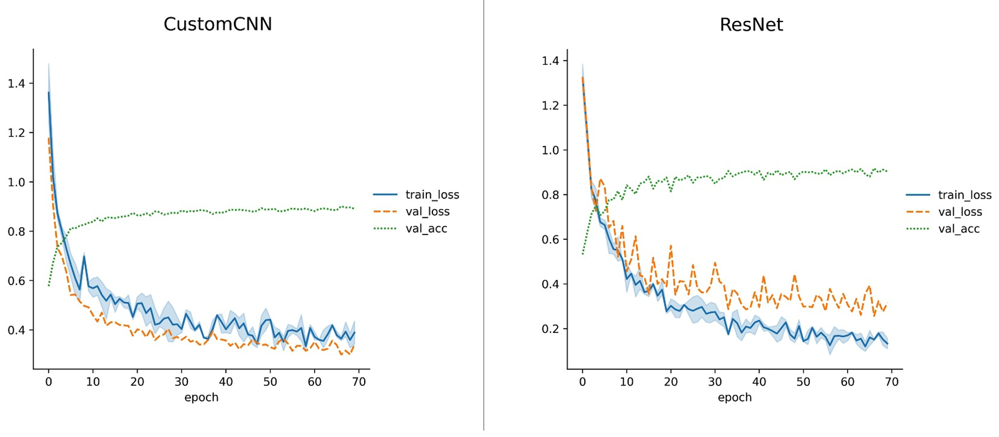

# Cifar10-Lightning

A pytorch-lightning training notebook using albumentations, with comparison of custom CNN and ResNet.

Building Environment 
---
- requirement: Docker, Git
- follow the steps below to build the training environment:
```
git clone https://github.com/jaywu109/cifar10-lightning.git
cd cifar10-lightning/docker
docker build -t cifar10_lightning_image .
docker run -itd --gpus all --name lightning_cifar10 cifar10_lightning_image:latest
```
- example to run container with bind mount:
  - mount directory on host machine `C:\Users\bbb50\Desktop\Python\lightning_cifar10` to directory inside container: `/workspace`
```
docker run -itd -v C:\Users\bbb50\Desktop\Python\lightning_cifar10:/workspace --gpus all --name lightning_cifar10_1 cifar10_lightning_image:latest
```

Training
---
- train custom CNN using `custom_cnn.ipynb`
- train custom CNN using `resnet.ipynb`

Experiment Result
---
- hardware: NVIDIA GeForce RTX 3060 Laptop GPU, Intel Core i7–11375H 11th
- trained for 70 epochs with `Adam`
- data augmentation with Albumentations: RandomCrop, HorizontalFlip, Cutout
- used built-in [learning rate finder](https://arxiv.org/abs/1506.01186) in pytorch lightning
- comparison:

|  | CustomCNN | ResNet |
| :----:| :----:| :----: |
| Accuracy | 89.02% | 90.79% |
| Parameter Size| 1.1M | 11.2M |
| Training Time | 20s/epoch | 60s/epoch |
| Learning Rate | 0.00109 | 0.00063 |

- loss & metrics comparision:



Acknowledgement:
---
The code is modified from https://colab.research.google.com/drive/1WX1hZoka1PqfaR23VyXFtRH6APXfFNfh?usp=sharing